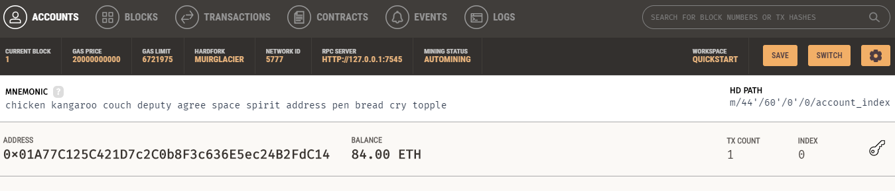
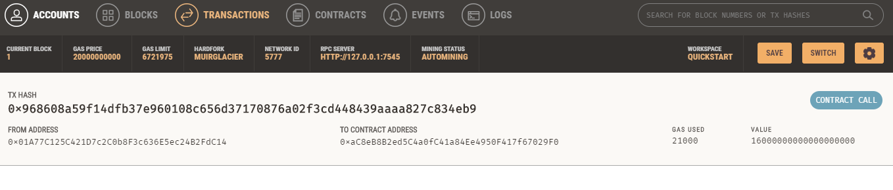
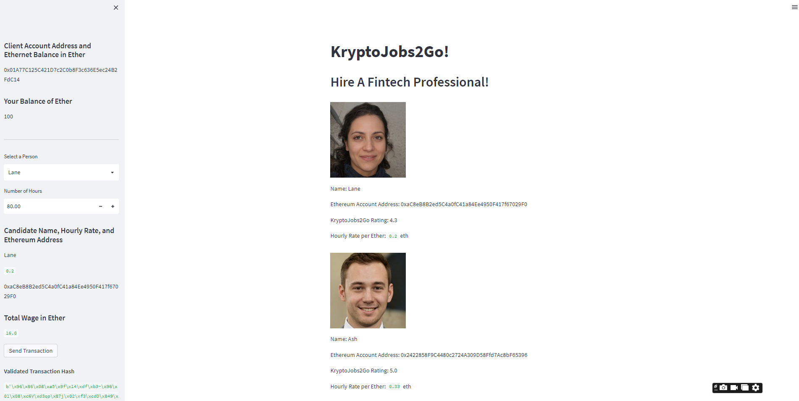

### Cryptocurrency Wallet

### Background

The task of this project is to integrate the Ethereum blockchain network into the KryptoJobs2Go application in order to enable our customers to instantly pay the fintech professionals whom we hire with cryptocurrency.

In this Challenge, I completed the code that enables our customers to send cryptocurrency payments to fintech professionals. To develop the code and test it out, I assumed the perspective of a KryptoJobs2Go customer who is using the application to find a fintech professional and pay them for their work.

### Details

To complete this Challenge, two Python files were used, both of which are present in the code folder.

The first file t is called `krypto_jobs.py`. It contains the code associated with the web interface of your application. The code included in this file is compatible with the Streamlit library. 

The second file  is called `crypto_wallet.py`. This file contains the Ethereum transaction functions. By using import statements, I integrated the `crypto_wallet.py` Python script into the KryptoJobs2Go interface program that is found in the `krypto_jobs.py` file.

Integrating these two files allowed me to automate the tasks associated with generating a digital wallet, accessing Ethereum account balances, and signing and sending transactions via a personal Ethereum blockchain called Ganache.

### Tasks

The following tasks were performed to accomplish the project:

* Generate a new Ethereum account instance by using the mnemonic seed phrase provided by Ganache.

* Fetch and display the account balance associated with your Ethereum account address.

* Calculate the total value of an Ethereum transaction, including the gas estimate, that pays a KryptoJobs2Go candidate for their work.

* Digitally sign a transaction that pays a KryptoJobs2Go candidate, and send this transaction to the Ganache blockchain.

* Review the transaction hash code associated with the validated blockchain transaction.

#### Step 1: Import Ethereum Transaction Functions into the KryptoJobs2Go Application

The following sub steps were followed to achieve Step 1:

1. Add the mnemonic seed phrase (provided by Ganache) to the .env file.

3. Imported the following functions from the `crypto_wallet.py` to `krypto_jobs.py` file:

    * `generate_account`

    * `get_balance`

    * `send_transaction`

4. Within the Streamlit sidebar section of code, create a variable named `account`. Set this variable equal to a call on the `generate_account` function. This function will create the KryptoJobs2Go customer’s HD wallet and Ethereum account.

5. Within this same section of the `krypto_jobs.py` file, define a new `st.sidebar.write` function that will display the balance of the customer’s account. Inside this function, call the `get_balance` function and pass it your Ethereum `account.address`.

#### Step 2: Sign and Execute a Payment Transaction

To accomplish the Step 2, the following steps were followed:

1. KryptoJobs2Go customers will select a fintech professional from the application interface’s drop-down menu, and then input the amount of time for which they’ll hire the worker. once a customer completes these steps, the application will calculate the amount that the worker will be paid in ether. To do so, complete the following steps:

    * Write the equation that calculates the candidate’s wage. This equation should assess the candidate’s hourly rate from the candidate database (`candidate_database[person][3]`) and then multiply this hourly rate by the value of the `hours` variable. Save this calculation’s output as a variable named `wage`.

    * Write the `wage` variable to the Streamlit sidebar by using `st.sidebar.write`.

2. Now that the application can calculate a candidate’s wage, write the code that will allow a customer  to send an Ethereum blockchain transaction that pays the hired candidate. To accomplish this, locate the code that reads `if st.sidebar.button("Send Transaction")`. An`if` statement logic was used that sends the appropriate information to the `send_transaction` function. Inside the `if` statement, add the following functionality:

    * Call the `send_transaction` function and pass it three parameters:

    * The Ethereum `account` information. 

    * The `candidate_address` 

    * The `wage` value. This will be passed to the `toWei` function to determine the wei value of the payment in the raw transaction.

    * Save the transaction hash that the `send_transaction` function returns as a variable named `transaction_hash`, and have it display on the application’s web interface.

#### Step 3: Inspect the Transaction

1. From the terminal, navigate to the project folder that contains your `.env` file and the `krypto_jobs.py` and `crypto_wallet.py` files.

2. To launch the Streamlit application, type `streamlit run krypto_jobs.py`.

3. On the resulting webpage, select a candidate that you would like to hire from the appropriate drop-down menu. Then, enter the number of hours that you would like to hire them for. (Remember, you do not have a lot of ether in your account, so you cannot hire them for long!)

4. Click the Send Transaction button to sign and send the transaction with your Ethereum account information. Navigate to the Transactions section of Ganache.

5. Return to the original transaction, and click the transaction’s To address.

Take a screenshot of the recipient’s address balance and history from your Ganache application. Save this screenshot to the README.md file of your GitHub repository for this Challenge assignment.

